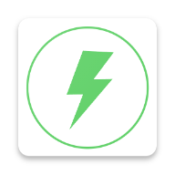

BoltSDK
=====

[](https://maven-badges.herokuapp.com/maven-central/in.revos.android/boltCore) | [View BoltSdk's documentation][1] | [Report an issue with BoltSDK][2]

BoltSDK is a fast and efficient library for Android that wraps locating EV chargers on map, navigate to charger station location, book a charger to charge your EV. Keeps track of booking history, manage subscriptions, earning history.



# Download
----------
With Gradle:

```
repositories {
        mavenCentral()
        maven { url "https://jitpack.io" }
        maven { url 'https://maven.cashfree.com/release'}
        google()
}

dependencies {
    implementation 'in.revos.android:boltCore:1.0.34'
}
```

# How do I use Bolt SDK ?
-------------------------
Check the [wiki][1] for detailed documentation

Simple use cases will look something like this:
```
public class MainActivity extends AppCompatActivity {

    private static String TAG = MainActivity.class.getName();
    @Override
    protected void onCreate(Bundle savedInstanceState) {
        super.onCreate(savedInstanceState);
        setContentView(R.layout.activity_main);

        BoltSDK.getInstance().initialize(MainActivity.this, "your_generated_api_key", "user_id", new StatusCallBack() {
            @Override
            public void onStatusChange(String s) {
                Log.d(TAG, "onStatusChange = " + s);
            }

            @Override
            public void onError(String s) {
                Log.d(TAG, "onError = " + s);
            }
        }, null, null, null, null, null, null);

        BoltSDK.getInstance().launchBolt();
    }
}
```
[1]: https://github.com/revos-dev/BoltSdkSample/wiki
[2]: https://github.com/revos-dev/BoltSdkSample/issues